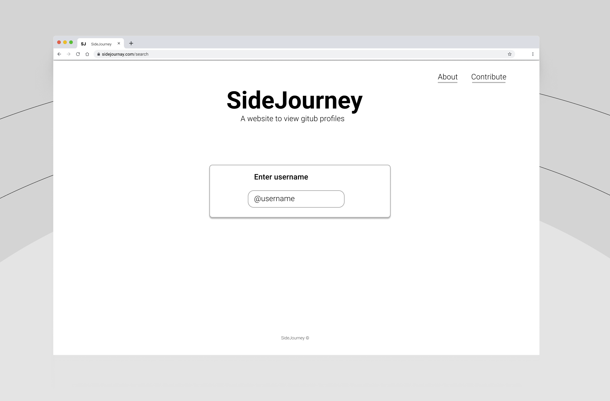
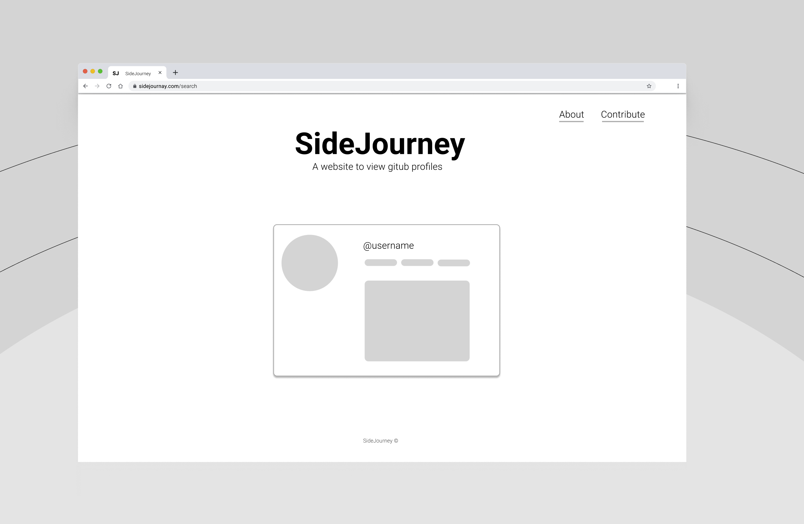

    

## Description
SideJourney is a front-end web application to get an overview of your github account

## User Interface

#### Home Page:

    

#### After entering username:

    

## Future Plans
The concept can be used to create an API to display the github profile overview

## How to contribute?

Fork the repo and do the necessary changes/changes assigned, commit the updates and pull request and we'll review your contribution.

